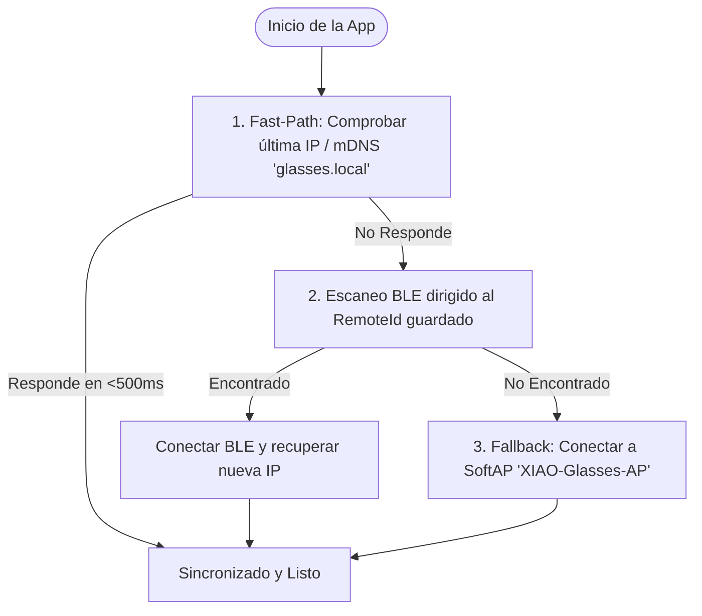

# 👓 Smart Glasses AI: Guía Maestra de Instalación y Arquitectura Paso a Paso

Esta guía explica en detalle cómo conectar el hardware (**Seeed Studio XIAO ESP32S3 Sense**), flashear el firmware, compilar la aplicación móvil en **Flutter** y conectar todo con tu backend de **IA Multimodal (OpenAI-compatible / vLLM / Ollama con RAG)**, además de usar todas las herramientas del **Modo Developer Suite**.

---

## 📐 1. Arquitectura de Conexión y Flujo del Sistema

```
+-------------------------------------------------------------------------------+
|                             GAFAS INTELIGENTES                                |
|  - Seeed Studio XIAO ESP32S3 Sense (Cámara OV2640/OV3660 + Micrófono PDM)    |
|  - Amplificador I2S MAX98357A + Mini Altavoz / Conductor Óseo en la patilla  |
|  - Modo Dual: Station Wi-Fi + SoftAP Fallback ('XIAO-Glasses-AP')             |
+------------------------------------+------------------------------------------+
                                     |
               (1) BLE: Emparejamiento y config Wi-Fi / Hotspot
               (2) Wi-Fi: Capturas JPEG (/capture), Audio I2S (/play_audio),
                          Beep Test (/beep), Ajustes Cámara (/camera_config)
                                     |
                                     v
+------------------------------------+------------------------------------------+
|                             APP MÓVIL FLUTTER                                 |
|  - UI Asistente con Presets Rápidos y Grabación de Voz                        |
|  - Dev Suite & HUD: Waterfall de Latencias, Inspector cURL, Pinout, Tuning   |
|  - Mock Simulator: Permite desarrollar sin hardware conectado                 |
+------------------------------------+------------------------------------------+
                                     |
               (3) STT: Audio -> Texto (/v1/audio/transcriptions)
               (4) Visión + RAG: Imagen Base64 + Prompt (/v1/chat/completions)
               (5) TTS: Respuesta -> PCM Audio (/v1/audio/speech)
                                     |
                                     v
+------------------------------------+------------------------------------------+
|                       BACKEND IA MULTIMODAL                                   |
|  - Modelo Multimodal (GPT-4o, Llama 3.2 Vision, Qwen2-VL, etc.)               |
|  - Base de Conocimiento RAG (Manuales de reparación, catálogo de productos)  |
+-------------------------------------------------------------------------------+
```

---

## 🛠️ 2. Guía para el Socio de Hardware (Pines y Cableado)

El módulo **Seeed Studio XIAO ESP32S3 Sense** consta de dos placas encajadas: la placa base ESP32-S3 y la placa de expansión superior (que ya tiene integrada la cámara OV2640/OV3660 y el micrófono digital PDM).

### Conexión del Altavoz I2S (Módulo MAX98357A):
Para que las gafas reproduzcan la voz del asistente por la patilla:

| Pin MAX98357A (Amplificador) | Pin XIAO ESP32S3 Sense | Función en Firmware |
| :--- | :--- | :--- |
| **VIN / VCC** | **5V** o **3V3** | Alimentación eléctrica |
| **GND** | **GND** | Tierra común |
| **BCLK** (Bit Clock) | **GPIO 7** (D6 en serigrafía) | Reloj de bits I2S |
| **LRC** / **LRCLK** (Word Select) | **GPIO 8** (D7 en serigrafía) | Reloj de canal I2S |
| **DIN** (Data In) | **GPIO 9** (D8 en serigrafía) | Datos de audio I2S |
| **GAIN** | Conectar a GND (+9dB) o flotante (+12dB) | Ganancia de volumen |
| **SD** (Shutdown) | Conectar a 3.3V | Mantener activo |

### Monitorización de Batería:
- El firmware incluye lectura ADC en **GPIO 1 (A0)** para calcular el voltaje y porcentaje restante de la batería LiPo 3.7V.
- Soldar los cables de la batería a los pads **BAT+** y **BAT-** en la cara inferior del XIAO ESP32S3.

---

## ⚡ 3. Flasheo del Firmware en las Gafas (Paso a Paso)

### Con PlatformIO en VS Code:
1. Instala la extensión **PlatformIO IDE** en VS Code.
2. Abre la carpeta `firmware/` del proyecto.
3. Conecta el XIAO ESP32S3 por cable USB-C de datos.
4. Presiona el botón de **Upload** (➜) en la barra inferior de PlatformIO.
5. Al encenderse, el microcontrolador emitirá un tono de confirmación en el altavoz y creará automáticamente una red Wi-Fi de emergencia **`XIAO-Glasses-AP`** (Clave: `12345678`) con IP `192.168.4.1`, lo que permite conectarse directamente en cualquier taller sin router Wi-Fi externo.

---

## 📱 4. Configuración y Ejecución de la App Móvil Flutter

### 1. Requisitos Previos:
- Flutter SDK (>= 3.0.0).

### 2. Configurar o Cambiar el Endpoint de IA:
Puedes cambiar la URL del servidor, API Key y Modelo directamente desde la pestaña **Config IA** en el Modo Developer dentro de la app móvil, o editar los valores por defecto en `mobile_app/lib/core/constants/api_constants.dart`.

### 3. Compilar y Ejecutar:
```bash
cd mobile_app
flutter pub get
flutter run
```

---

## 🔄 5. Capa de Sincronización Robusta y Persistencia (NVS + SharedPreferences)

El sistema cuenta con un motor de sincronización de **3 niveles con reconexión automática y persistencia**:



### Características Clave de la Sincronización:
1. **Memoria NVS en las Gafas**:
   - Cuando configuras el Wi-Fi por primera vez, el ESP32-S3 guarda el SSID y contraseña en su memoria Flash no volátil (`Preferences`).
   - Al reiniciar o encender las gafas, se conectan automáticamente a la red Wi-Fi sin necesidad de que abras la pantalla de emparejamiento.
2. **Resolución mDNS (`http://glasses.local`)**:
   - Permite que el móvil localice las gafas en la red local incluso si el router les asigna una dirección IP distinta.
3. **Persistencia en el Móvil (`SharedPreferences`)**:
   - Guarda el identificador único del Bluetooth (`RemoteId`), el nombre del dispositivo y la última IP conocida.
   - Si cierras la app y la vuelves a abrir, realiza un **Fast-Path Sync** instantáneo sin mostrar pantallas de carga.
4. **Heartbeat y Auto-Recuperación**:
   - Un temporizador en segundo plano monitoriza el estado de las gafas cada 5 segundos. Si se corta la conexión, intenta la reconexión automática de inmediato.
5. **Gestión en UI**:
   - Permite reconectar con 1 botón o pulsar **"Olvidar"** para desvincular el dispositivo actual y emparejar unas gafas nuevas.

---

## 🧰 6. Funcionalidades del Modo Developer (Dev Suite & HUD)

Al pulsar el icono de **Bug / Herramientas** en la esquina superior derecha de la app:
1. **Waterfall de Latencias**: Visualización en barras con el desglose exacto de milisegundos en cada etapa:
   - Captura y transferencia JPEG por Wi-Fi ($t_{cam}$).
   - Inferencia LLM Multimodal ($t_{llm}$).
   - Síntesis de voz TTS ($t_{tts}$).
   - Streaming de audio hacia el altavoz I2S ($t_{i2s}$).
2. **Control y Calibración de Cámara**:
   - Ajusta brillo, contraste y compresión JPEG en vivo mediante sliders que envían órdenes inmediatas al sensor OV2640/OV3660.
   - Botón para forzar captura manual instantánea y ver la foto.
3. **Inspector cURL y JSON**:
   - Genera el comando `curl` exacto con 1 botón para copiarlo al portapapeles y reproducir cualquier consulta desde la terminal de tu PC.
   - Visor JSON formateado de las respuestas brutas del backend y metadatos RAG.
4. **Hardware & Pinout**:
   - Botón de autodiagnóstico **"Test Tono I2S (Beep)"** para verificar que el amplificador y altavoz funcionan sin necesidad de internet.
   - Esquema visual de pines para resolver dudas del montaje físico al instante.
5. **Modo Mock / Simulador**:
   - Interruptor para simular las gafas y respuestas de IA sin tener la placa física conectada, ideal para avanzar en la interfaz o probar prompts.

---

## 🛡️ 7. Mecanismos de Resiliencia y Anti-Brick (Tolerancia Total a Fallos)

Para evitar que las gafas queden inservibles o bloqueadas durante pruebas o en producción:

| Mecanismo de Seguridad | ¿Qué hace? | ¿Cómo protege el sistema? |
| :--- | :--- | :--- |
| **Hardware Task Watchdog (WDT - 8s)** | Monitoriza el hilo principal del ESP32-S3. | Si un driver de cámara o DMA se congela por fallo de bus, el microcontrolador se reinicia automáticamente en 8 segundos sin requerir intervención manual. |
| **SoftAP Permanente (`192.168.4.1`)** | Mantiene el punto de acceso `XIAO-Glasses-AP` siempre activo. | Si la red Wi-Fi del router se cae, cambia de clave o estás en exteriores, puedes conectarte directamente a las gafas en cualquier momento. |
| **Camera Access Mutex & Auto-Reinit** | Bloquea colisiones concurrentes y cuenta fallos. | Si la cámara falla 3 lecturas consecutivas (por ejemplo por flex desconectado momentáneamente), reinicia el bus DVP automáticamente sin colapsar el sistema. |
| **Actualización OTA Inalámbrica (`/update`)** | Permite flashear nuevos `.bin` por Wi-Fi. | Una vez ensambladas y selladas las gafas en su montura 3D, no necesitas desmontarlas ni conectar cables USB para actualizar el software. |
| **Factory Reset Remoto (`/factory_reset`)** | Limpia la memoria NVS de credenciales corruptas. | Disponible con un botón en el Modo Developer para devolver el dispositivo a su estado original de fábrica. |
| **Fallback de Audio Inteligente** | Si el altavoz I2S no responde o se desconecta. | La app móvil conmuta instantáneamente al altavoz del teléfono para no interrumpir la experiencia del usuario. |

---

## 8. Flujo de trabajo de campo (app profesional y modo bolsillo)

La app está diseñada para operar como una **app de música**: puedes bloquear el móvil, meterlo al bolsillo y trabajar con ambas manos libres.

1. **Activar Modo Pantalla Bloqueada**: Pulsa el icono de candado/pantalla en la barra superior o en Diagnóstico → Hardware.
2. **Notificación persistente con acciones**:
   - En la pantalla de bloqueo verás los botones: **🔍 Identificar**, **🩺 Diagnosticar**, **📋 Procedimiento**.
   - Al pulsar un botón con el móvil bloqueado, el teléfono solicita captura a las gafas por Wi-Fi, consulta a la IA y reproduce la respuesta por audio sin necesidad de desbloquear.
3. **Audio ininterrumpido**: El motor de audio (`AudioContext` con `stayAwake` y categoría `playback`) garantiza que la voz de la IA se escuche por la patilla o el teléfono con la pantalla apagada.
4. **Atajos visuales en pantalla**: Si tienes el móvil a la vista, usa los chips superiores: Identificar, Diagnosticar, Procedimiento, Nº de serie.
5. **Contexto de trabajo**: Puedes configurar una **orden de trabajo** en Diagnóstico → IA para que cada consulta quede etiquetada.

---

## 9. Filtro Edge de Voz y Biometría (Sherpa-ONNX + Vosk)

Para entornos ruidosos, talleres o lugares con varias personas hablando alrededor, la app cuenta con un **Gatekeeper local inteligente**:

### ¿Cómo funciona la protección de audio?
1. **Descarte de Silencio / Ruidos (VAD RMS)**: Si el audio capturado no supera el umbral energético mínimo, se descarta instantáneamente en el teléfono sin realizar llamadas de red.
2. **Identificación Biométrica de Locutor (Sherpa-ONNX Speaker ID)**:
   - Extrae un vector de embedding acústico espectral de 192 dimensiones normalizado L2.
   - Compara la similitud de coseno contra el perfil del técnico.
   - Si habla otra persona en la habitación, la similitud será inferior al umbral ($\approx 68\%$) y la petición **no se transmitirá al servidor**, protegiendo la privacidad y evitando activaciones espurias.
3. **Reconocimiento de Intenciones & Palabras Clave (Vosk)**:
   - Filtra palabras de activación (`gafas`, `oye gafas`, `asistente`).
   - Comprueba intenciones técnicas autorizadas (`identifica`, `diagnostica`, `desmontar`, `voltaje`).
   - Intercepta comandos de hardware (`bateria`, `beep`, `ping`) para ejecutarlos en local sin coste de API.

### Calibración del Perfil del Técnico:
1. Abre el menú **Diagnóstico** (icono monitor) → pestaña **Filtro Voz**.
2. Pulsa **Calibrar mi voz**.
3. Di en voz alta: *"Gafas activa soporte técnico"* durante 3 a 5 segundos.
4. Pulsa **Detener Calibración**. El perfil almacenará tu huella acústica. Puedes agregar varias muestras para mejorar la precisión en distintos tonos de voz.

---

## 10. OTA y recuperación

1. Compila el `.bin` con PlatformIO (`firmware/.pio/build/seeed_xiao_esp32s3/firmware.bin`).
2. En la app: Diagnóstico → Hardware → **OTA .bin**.
3. No cortes la batería durante la subida. Las gafas reinician solas.
4. Si no responden: conéctate a `XIAO-Glasses-AP` / `192.168.4.1` y reintenta.
5. **Reset NVS** borra el Wi-Fi corrupto. El Watchdog (10 s) recupera cuelgues de DMA.

---

## 11. Tests

```bash
cd mobile_app
flutter pub get
flutter test

cd ../firmware
pio test -e native
```

Los tests de Flutter (42 pruebas unitarias y de widgets) cubren batería, cURL redactado, candidatos de sync, WAV/resample, telemetría JSON, mocks, acciones de segundo plano/lockscreen, verificación biométrica de locutor y filtro de intenciones Vosk.

---

## 12. API HTTP resumida

Ver `docs/API_FIRMWARE.md`. Endpoints nuevos: `/`, `/health`, `/selftest`, `/mic_sample`. Reinicio y factory reset son **diferidos** (no `delay` dentro del handler Async).

---

## 13. Solución de problemas

| Síntoma | Qué hacer |
| :--- | :--- |
| App no encuentra gafas | SoftAP `XIAO-Glasses-AP`, IP `192.168.4.1`, o BLE scan |
| Cámara 503 | Flex, luz, o 3 fallos → auto-reinit. Self-test en HUD |
| Audio agudo/rápido | El firmware espera PCM mono 16 kHz; la app remuestrea 24→16 |
| Consulta de voz ignorada | Revisa en Diagnóstico → Filtro Voz si el audio fue descartado por no coincidir el locutor o no incluir palabra clave |
| OTA FAIL_UPDATE | Binario de la env `seeed_xiao_esp32s3`, no otro board |
| Brick aparente | Espera 10 s (WDT), SoftAP sigue activo |
